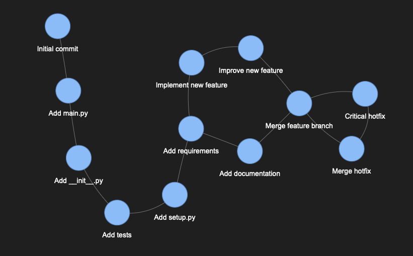
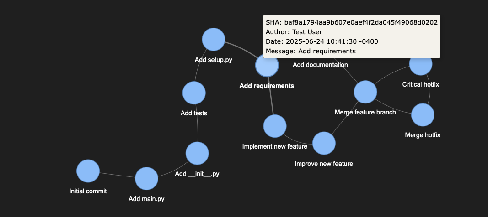

# GitViz

<p align="center">
  
</p>

**GitViz** is a modern, lightweight Python CLI tool that transforms Git repository commit history into interactive visualizations. GitViz generates dynamic, web-based graphs that make understanding Git workflows intuitive and visually appealing.

## Quick Start

### Install

#### From PyPI (When Published)

````bash
pip install gitviz
````

#### From Source

````bash
git clone https://github.com/yourusername/gitviz.git
cd gitviz
pip install -e .
````

## Basic Usage

- **Generate visualization of current repository**

````bash
gitviz
````

- **Custom output file**

````bash
gitviz --output my-project-history
````
- **Limit commit history**

````bash
gitviz --max-commits 50
````

- **Specify a different repository**
````bash
gitviz --path /path/to/other/repo
````

## Example Outputs

<p align="center">
  
</p>

<p align="center">
  
</p>


## Future Work

### Additional Visualization Engines

* **Matplotlib Backend**: Static, high-quality plots suitable for publications.
* **WebGL Engine**: High-performance rendering for large repositories.
* **ASCII Art Engine**: Terminal-based visualizations for headless environments.

### ML Integration

#### Intelligent Commit Analysis

* **Message Classification**: Automatically categorize commits by type:

  * Bug fixes
  * New features
  * Documentation
  * Configuration
  * Code style
  * Performance improvements
  * Security updates

* **Smart Visual Encoding**:

  * Different shapes for commit types
  * Color intensity based on change magnitude
  * Node size variation based on impact analysis

* **Intelligent Clustering**: Group related commits visually to highlight patterns.

* **Risk Assessment**: Detect and highlight potentially problematic commits.

* **Developer Pattern Recognition**: Identify coding patterns and contributor styles.

---
