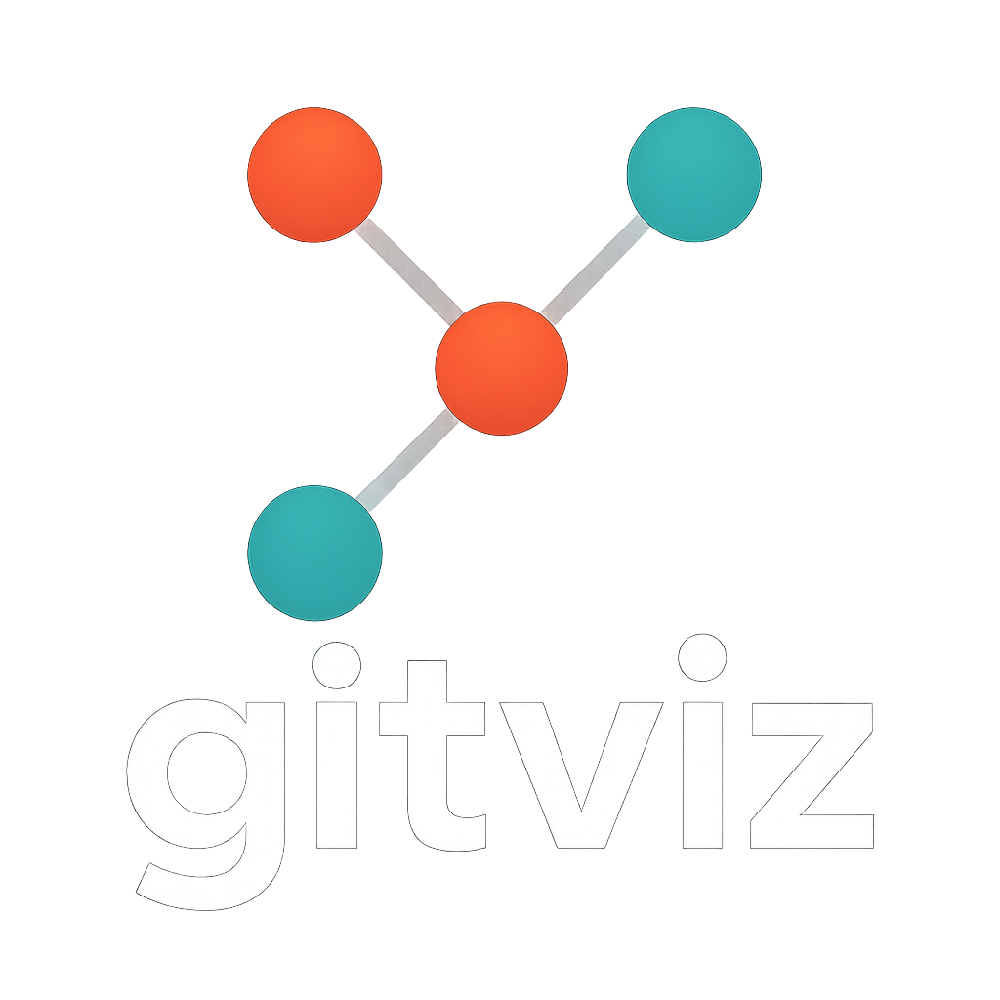

# GitViz

<p align="center">
  
</p>

**GitViz** is a Python CLI tool that transforms Git repository commit history into interactive visualizations. GitViz generates dynamic, web-based graphs that make understanding Git workflows intuitive and visually appealing.

## Quick Start

### Install

#### From PyPI (When Published)

````bash
pip install gitviz
````

#### From Source

````bash
git clone https://github.com/yourusername/gitviz.git
cd gitviz
pip install -e .
````

#### Optional Dependencies

For additional rendering engines:

````bash
# For matplotlib static plots
pip install gitviz[matplotlib]

# For all engines
pip install gitviz[all]
````

## Basic Usage

- **Generate visualization of current repository**

````bash
gitviz
````

- **Custom output file**

````bash
gitviz --output my-project-history
````
- **Limit commit history**

````bash
gitviz --max-commits 50
````

- **Specify a different repository**
````bash
gitviz --path /path/to/other/repo
````

- **Use different rendering engines**

````bash
# Interactive HTML visualization (default)
gitviz --engine pyvis --format html

# Static high-quality plot
gitviz --engine matplotlib --format png

# Terminal-based ASCII visualization
gitviz --engine ascii --format txt
````

- **Auto-select engine based on format**

````bash
# Automatically uses matplotlib for PNG
gitviz --format png

# Automatically uses ascii for text
gitviz --format txt

# Automatically uses pyvis for HTML
gitviz --format html
````

- **List available engines**

````bash
gitviz --list-engines
````

## Example Outputs

<p align="center">
  
</p>

<p align="center">
  
</p>


## Future Work

### Additional Visualization Engines

* **WebGL Engine**: High-performance rendering for large repositories.
* **Graphviz Integration**: More sophisticated graph layouts and styling.

### ML Integration

#### Intelligent Commit Analysis

* **Message Classification**: Automatically categorize commits by type:

  * Bug fixes
  * New features
  * Documentation
  * Configuration
  * Code style
  * Performance improvements
  * Security updates

* **Smart Visual Encoding**:

  * Different shapes for commit types
  * Color intensity based on change magnitude
  * Node size variation based on impact analysis

* **Intelligent Clustering**: Group related commits visually to highlight patterns.

* **Risk Assessment**: Detect and highlight potentially problematic commits.

* **Developer Pattern Recognition**: Identify coding patterns and contributor styles.

## Testing

### Run All Tests

````bash
python run_tests.py
````

### Run Specific Tests

````bash
# Integration tests
python tests/test_integration.py

# Unit tests (requires pytest)
pytest tests/test_engines.py -v
````

### Install Test Dependencies

````bash
pip install gitviz[dev]
````